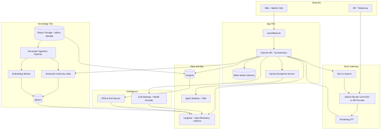

# AI Engineer Technical Assignment

Submission for an AI Engineer technical assignment focused on a telco customer-support agent.

## What Is Included

| Deliverable | Location | Notes |
| :-- | :-- | :-- |
| Working code for Q1 | [Question1](Question1/) | FastAPI customer-service AI agent with RAG, tests, Docker, and live smoke scripts |
| README with setup instructions | [Question1/README.md](Question1/README.md) | Local and Docker workflows, prompt/chunking/embedding rationale |
| Architecture diagram | [Question2/architecture.png](Question2/architecture.png) | Also included as Mermaid source and SVG export |
| Design and evaluation document | [Question2/design.md](Question2/design.md) | Production architecture, evaluation, observability, and failure modes |

## Assignment Checklist

| Assignment need | Where it is covered |
| :-- | :-- |
| `FastAPI` `/chat` endpoint with JSON reply and `escalate` flag | [Question1/README.md](Question1/README.md) and [Question1](Question1/) |
| RAG ingestion and retrieval over the provided knowledge base | [Question1/README.md](Question1/README.md) |
| Prompt, chunking, embedding, and limitation explanation | [Question1/README.md](Question1/README.md) |
| Architecture diagram | [Question2/architecture.png](Question2/architecture.png) |
| Production design, evaluation, observability, and failure modes | [Question2/design.md](Question2/design.md) |

## Quick Review Path

If you want the fastest way to review the submission:

1. Read [Question1/README.md](Question1/README.md) for the implementation choices and runnable commands.
2. Review [Question2/architecture.png](Question2/architecture.png) for the production system overview.
3. Read [Question2/design.md](Question2/design.md) for the system-design, evaluation, and observability reasoning.

## Solution Highlights

- Clean, testable Q1 service with `FastAPI`, `Granian`, `Qdrant`, Gemini embeddings, and OpenRouter generation via the Python `openai` SDK.
- The OpenRouter Responses API is used with provider preferences, so query rewriting can prefer a fast cheap path while final grounded answers use a stronger cached generation path.
- Kimi is used intentionally for answer quality and cost reasons, while provider-specific logic stays isolated behind adapters.
- App-controlled RAG with a model-assisted retrieval-query rewriting step for long conversations.
- A labeled 28-case retrieval benchmark comparing dense, hybrid, and optional rerank retrieval paths on the assignment corpus.
- A separate chat-evaluation benchmark with multi-turn and escalation-required cases, plus stage latency breakdowns.
- Deterministic escalation behavior when retrieval is weak or missing.
- Local and Docker workflows that were both verified with real provider-backed smoke tests.
- Production-oriented Q2 design covering chat, voice, memory, KB updates, observability, and failure response.

## Verified Commands

All of the following were run successfully during implementation:

```bash
cd Question1
make test
make coverage
make lint
make typecheck
make smoke
make eval-retrieval
make eval-chat
make docker-build
make docker-up
make docker-ingest
make docker-smoke
```

## Environment

Copy [.env.example](.env.example) to `.env` and provide valid credentials:

- `OPENROUTER_API_KEY`
- `GEMINI_API_KEY`

## Architecture Preview



Additional diagram artifacts:

- [Question2/architecture.mmd](Question2/architecture.mmd)
- [Question2/architecture.svg](Question2/architecture.svg)
